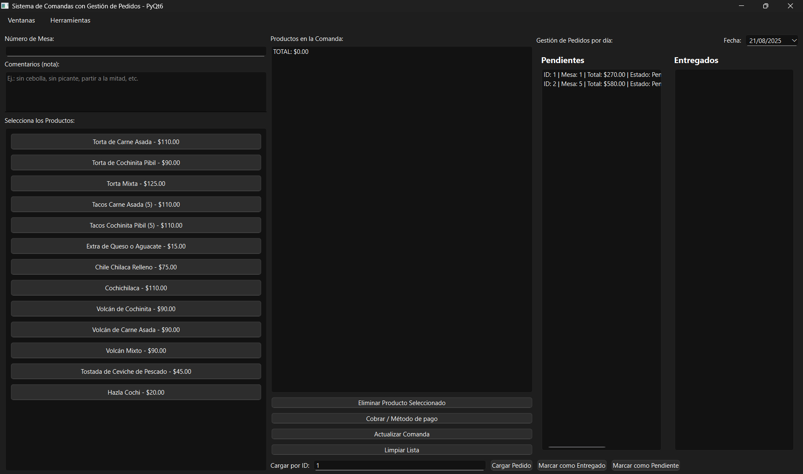
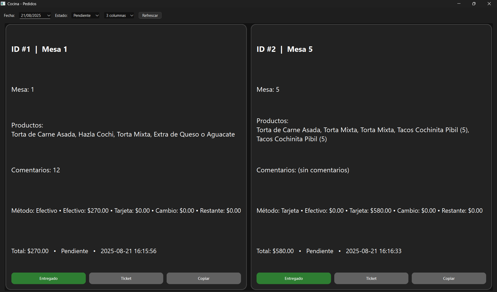

# README

## Sistema de Comandas con Gestión de Pedidos

Este es un sistema desarrollado en Python utilizando **PyQt6** para la creación de una interfaz gráfica que permite registrar, cobrar, modificar y gestionar pedidos en un restaurante. Los pedidos se almacenan en archivos CSV, que incluyen la información de los productos seleccionados, la mesa, el método de pago, el total y el estado del pedido.

### Capturas de pantalla

Pantalla Principal:  


Pantalla de Cocina:  


### Funcionalidades principales:

- **Registro y cobro de pedidos**  
  Se registran los pedidos seleccionando mesa, productos, comentarios y el método de pago (**Efectivo, Tarjeta o Combinado**).  
  El sistema calcula cambio, restante o cobros adicionales según sea necesario.

- **Actualización de pedidos**  
  Es posible editar un pedido existente y actualizar pagos, con registro de ingresos, devoluciones o diferencias en caja.

- **Gestión de estado de pedidos**  
  Se pueden marcar pedidos como **Pendiente** o **Entregado**, tanto en la vista principal como en la vista de cocina.

- **Gestión de caja**  
  - Solicita **fondo inicial** al iniciar.  
  - Registra ingresos, devoluciones y cambios.  
  - Permite generar un **corte de caja** con ventas en efectivo, tarjeta, devoluciones y saldo final del día.

- **Analítica**  
  Incluye gráficas y tablas de ventas (general, por día o semana) con opción de exportar resultados a CSV.

### Requisitos

- Python 3.x  
- PyQt6  
- matplotlib  

### Instalación

1. Clona este repositorio o descarga el archivo `main.py` en tu máquina local.
2. Instala las dependencias necesarias:
   ```bash
   pip install PyQt6 matplotlib
````

3. Ejecuta el sistema:

   ```bash
   python main.py
   ```

### Archivos principales

* `main.py` → Código principal del sistema.
* `comandas_estado.csv` → Registro de pedidos.
* `caja_movimientos.csv` → Registro de movimientos de caja (fondo, ingresos, devoluciones, cambios).
* `resources/` → Carpeta con imágenes de referencia.

### Flujo del sistema

```mermaid
flowchart TD
    A[Inicio] --> B[Apertura de caja (Fondo inicial)]
    B --> C[Registro de pedido]
    C --> D[Selección de productos]
    D --> E[Registro de pago<br/>(Efectivo / Tarjeta / Combinado)]
    E --> F[Generar comanda]
    F --> G[Vista Cocina - Pendientes]
    G --> H[Entrega de pedido]
    H --> I[Actualizar estado: Entregado]
    I --> J[Corte de caja]
    J --> K[Resumen del día<br/>Efectivo / Tarjeta / Devoluciones / Saldo final]
```

### Autor

* **Desarrollado por**: Marcelo Morales
